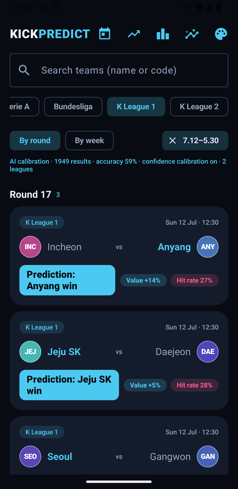
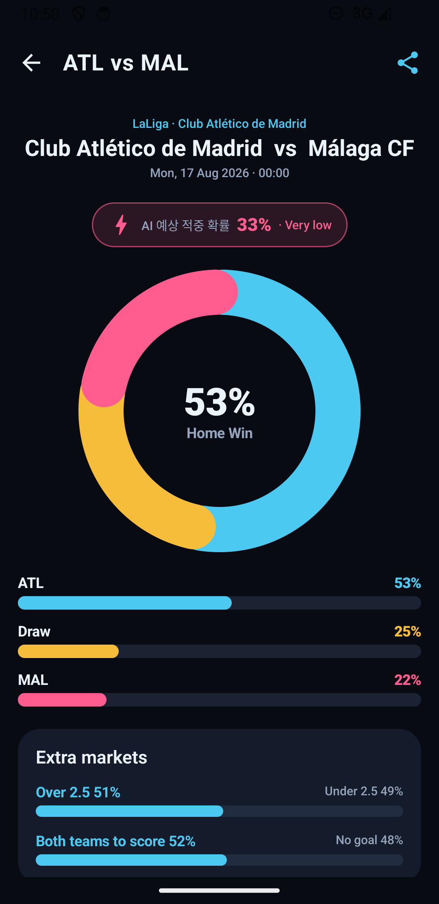
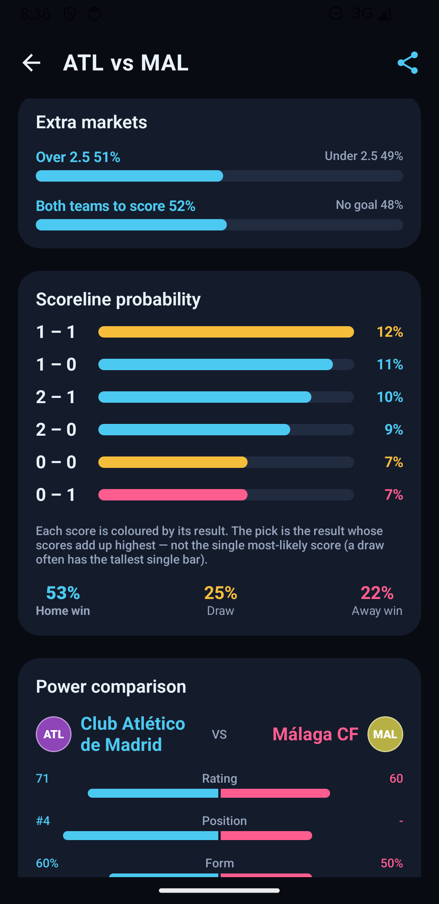
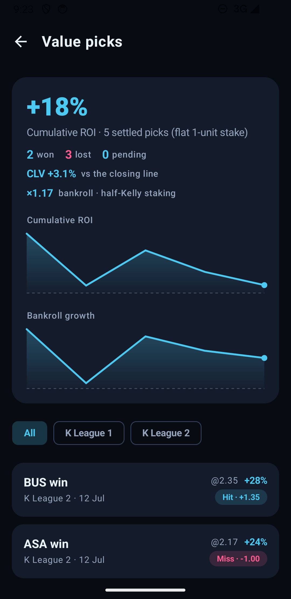
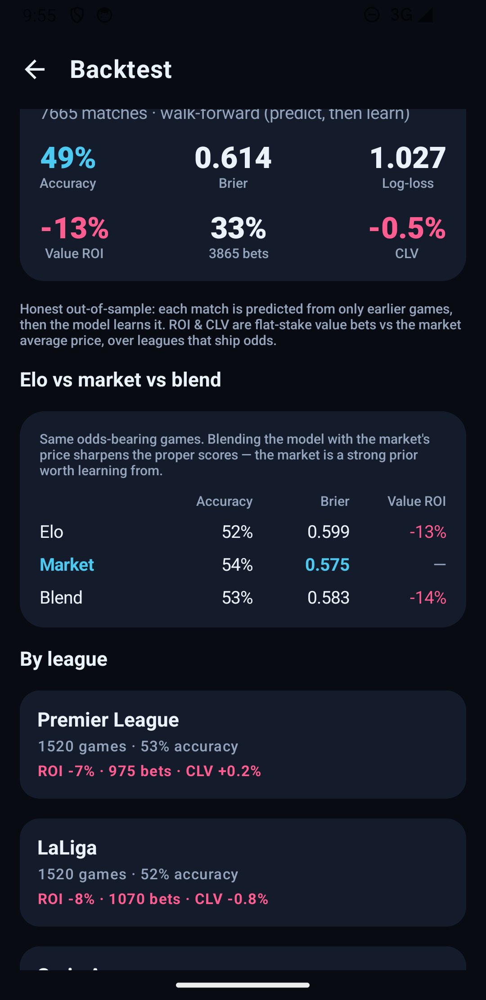
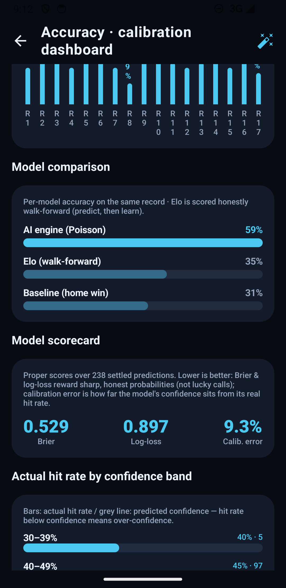
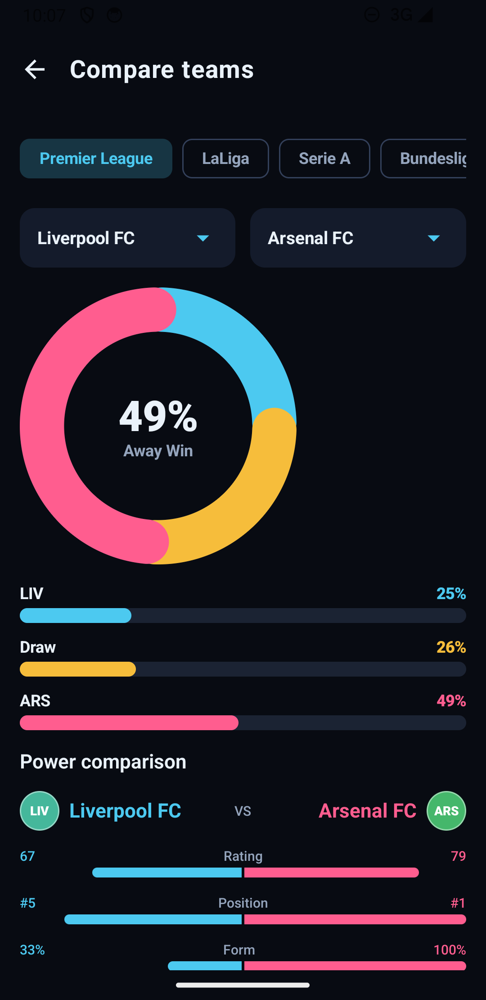
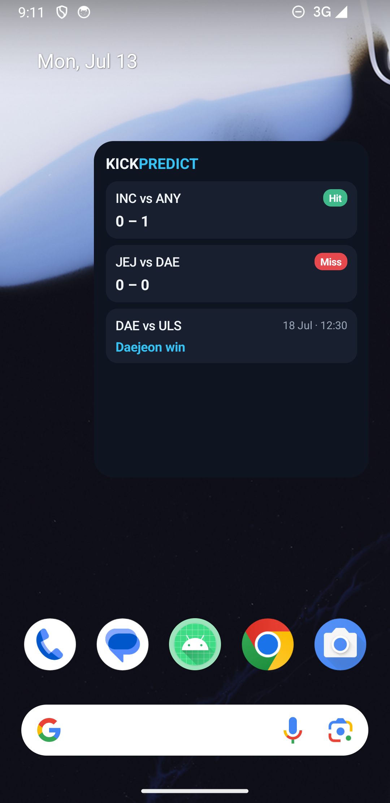
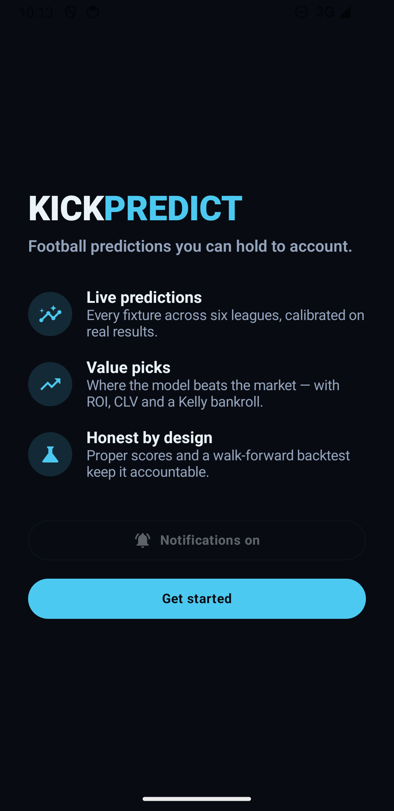

# Kick Predict

An Android app that predicts match outcomes for six football leagues — **EPL, LaLiga, Serie A,
Bundesliga, K League 1 & 2** — from **live current-season data**, evaluates itself honestly, and
surfaces where the model beats the market. First-class support for the **Galaxy Z Fold 3** (cover
screen and unfolded main screen).

Built with **Kotlin + Jetpack Compose**, **MVVM + Clean Architecture**, Compose Navigation,
Retrofit/OkHttp, Room, WorkManager and Glance. Four switchable colour themes (defaulting to
**Floodlight**) and a live **Korean / English** switch.

## Features

- **Live current-season predictions** across six leagues — Europe from football-data.org, K League
  from APIFootball, with a bundled-history fallback so it runs with zero, one or both API keys.
- **Prediction engine** — a Poisson scoreline grid (Dixon-Coles) × learned Elo × recency/venue-weighted
  head-to-head, a separate confidence score, and injury/lineup/weather context. Probabilities are
  **tempered toward the market price** where odds exist (Model / Balanced / Market-led in settings).
- **Honest evaluation** — a calibration dashboard (accuracy, reliability, per-model comparison), a
  **proper-scoring scorecard** (Brier / log-loss / calibration error), and a **walk-forward backtest**
  over four bundled seasons that compares Elo vs the market vs a blend.
- **Value picks** — flags fixtures where the model beats the market, with a hub that logs each pick at
  its price and settles a **ROI ledger**: cumulative-ROI trend, **CLV** (closing-line value) and a
  **half-Kelly bankroll** curve.
- **Engagement** — background **match notifications** (kickoff / live / result, value-tagged), **team
  follows** (Followed filter + scoped notifications), a resizable **home-screen widget** (live / results
  / upcoming, configurable per league or followed), **share a prediction** as a branded image, and a
  first-run **onboarding**.
- **Depth** — Monte-Carlo season simulation, team pages (season record, form detail, head-to-head),
  team comparison, and standings.
- **Polish** — four themes, Korean / English with an in-app switch, foldable-responsive layouts, and an
  accessibility pass (screen-reader descriptions on the charts).
- **Tested** — 67 unit tests (engine, calibration, value / ROI / CLV / Kelly, scorecard, backtest,
  notifications, market blend).

## Screenshots

| Fixtures & predictions | Match detail | Scoreline aggregation |
|---|---|---|
|  |  |  |

| Value-pick hub — ROI · CLV · Kelly | Walk-forward backtest | Accuracy dashboard |
|---|---|---|
|  |  |  |

| Team comparison | Home-screen widget | Onboarding |
|---|---|---|
|  |  |  |

## Architecture

Single `:app` module, organised by Clean Architecture layer:

```
com.kickpredict
├── domain          # pure Kotlin, no Android deps
│   ├── model       # LeagueType, Match, TeamProfile, HeadToHead, PredictionResult …
│   ├── engine      # PredictionEngine (Poisson win/draw/away % + Confidence + expected score)
│   ├── calibration # Calibrator + CalibrationDefaults (real-data league scoring rates)
│   ├── simulation  # ScoreGrid, SeasonSimulator, SeasonRules (Monte-Carlo season projection)
│   ├── standings   # LeagueTable — shared table build + ranking rules
│   ├── repository  # MatchRepository interface
│   └── usecase     # GetPredictedMatch(es)UseCase, SimulateSeasonUseCase
├── data
│   ├── mock        # MockDataProvider — the 4 offline test scenarios
│   ├── local       # Room: KickPredictDatabase, TeamDao, TeamEntity, Converters
│   ├── remote      # Retrofit PredictionApi + DTOs (live path, stubbed)
│   └── repository  # MatchRepositoryImpl
├── di              # AppContainer (manual DI)
└── presentation
    ├── theme       # AppPalette/AppTheme, LocalPalette, picker + persisted choice
    ├── navigation  # KickPredictNavHost
    ├── matchlist   # list screen + ViewModel
    ├── detail      # responsive prediction screen + ViewModel
    ├── simulation  # season projection screen (cutoff slider) + ViewModel
    └── components  # ConfidenceBadge, PredictionDonutChart, ProbabilityGauges, PowerComparisonReport
```

## Prediction engine

`domain/engine/PredictionEngine.kt` is pure, side-effect-free Kotlin. It produces:

1. **Win / draw / away probabilities** from a **Poisson scoreline model**. Each side's expected goals
   (λ) are built from data-calibrated league scoring rates × the teams' own scoring rates (dampened by a
   0.6 exponent), then skewed by a quality index (`0.45·rating + 0.25·position + 0.30·form`), league
   rules and the matchup correction. The full 9×9 score grid is summed into H/D/A, with the level
   diagonal scaled by the league's draw-inflation factor. The most-likely **scoreline** falls out for
   free (shown as "예상 스코어" in the UI).
   - Bundesliga: extra home boost · Serie A: high draw inflation · LaLiga: amplified position-gap ·
     EPL / K League: fatigue penalty for ≤4 days rest.
2. **Confidence Score** ("AI 예상 적중 확률", 0–100) = `0.25·data-volume + 0.35·win-prob-gap +
   0.20·schedule-stability + 0.20·H2H-consistency`, expanded ×1.25 around the 50% midpoint. This is how
   much the engine trusts *this* prediction, independent of who it favours.

### Real-data calibration

`domain/calibration/Calibrator.kt` derives each league's `LeagueCalibration` (home/away goal averages +
draw inflation) from historical results via maximum-likelihood averages; draw inflation = observed draw
rate ÷ Poisson-implied draw rate. With no dataset wired here, the engine falls back to `CalibrationDefaults`
(realistic per-league values). The engine takes a `CalibrationProvider`, so swapping in `DataCalibration`
computed from real fixtures is a one-liner.

### Matchup — 상성 / bogey teams (recency- & venue-weighted)

A side that has been winning the head-to-head gets a λ boost (`±0.42 · H2H-bias`) and its opponent a
matching cut — strong enough for a weaker "bogey team" (천적) to swing a fixture it would lose on paper
(scenario D). The bias is a weighted average of past meetings where:
- **recency** — the i-th most-recent meeting is weighted `0.7^i`, and
- **home/away venue** — a meeting played at *this fixture's* ground is additionally ×1.6.

So the same 2–0–2 tally reads differently by recency (recent home wins → higher home%) and by venue
(home wins earned at this ground count for more). `matchupBias` is exposed on `PredictionResult` and shown
as a 🔥 **상성 banner** (record + most-recent-first chips, ringed = at this venue) plus a **상성 chip** on
each match card.

### Test scenarios (from `MockDataProvider`)

| Scenario | League   | Setup                                   | Result (H/D/A) | Confidence | 예상 |
|----------|----------|-----------------------------------------|----------------|------------|------|
| A        | EPL      | 1st (home) vs 20th (away)               | 92 / 7 / 1     | **97% Very High** | 3–0 |
| B        | Serie A  | two even, draw-prone sides              | 34 / 37 / 29   | **58% Moderate**  | 1–1 |
| C        | K League | rested home vs tired away (rain, injury)| 44 / 29 / 27   | **32% Low**       | 1–1 |
| D        | EPL      | bogey home vs top-2 (2 visitors injured)| 43 / 29 / 28   | **59% Moderate** (상성) | 1–1 |

### Context variables — injuries · lineup · weather

`MatchContext` (on each `Match`) carries per-team availability (`keyPlayersInjured`, `lineupStrengthPercent`)
and `Weather`. Availability scales that side's λ (~0.6–1.0); adverse weather dampens both λ (rain 0.94 …
snow 0.85), which raises the draw probability. Each live variable (fatigue, injuries, adverse weather)
also lowers the **Confidence Score** by one step. Shown as "경기 변수" chips in the report.

### Confidence hit-rate calibration

`domain/calibration/ConfidenceCalibrator.kt` fits a reliability curve from historical
`PredictionRecord`s via isotonic regression (pool-adjacent-violators over confidence bins), so a
systematically over-confident engine ("90% but right 60%") is pulled down to its true hit rate. The
engine takes a `ConfidenceCalibration` (identity by default); swap in a fitted one to re-map scores.

**The curve is fitted on `PredictionResult.rawConfidenceScore`, never on the displayed
`confidenceScore`.** `PredictionEngine` reports both, and `prediction_log` stores both: `confidence` is
what the user saw, `rawConfidence` is what the engine computed before the curve touched it. Training on
the displayed score maps the correction back through itself — since `MatchListViewModel.load()` refits
and then re-logs on every resume, the shown confidence flipped between two values (63% → 46% → 63% …)
forever. `ConfidenceCalibrationLoopTest` pins both halves: the wiring, and that repeated refits settle.

### Offline-first data

`MatchRepositoryImpl` is offline-first: try the live `PredictionApi`, cache the payload to Room
(`fixture_cache`), and on failure fall back to the last cache — or bundled `MockDataProvider` fixtures if
the cache is empty, so the UI is never blank. (No live API host is wired, so the app runs off the mock
seed here.)

## Fixtures list — teams, crests, filtering

- **Real clubs + Korean names:** `TeamProfile` carries `koreanName` and club colours; the sample
  catalog (`data/mock/Teams.kt`) holds real clubs across all five leagues. Team marks are **generated
  in-app** (`presentation/components/TeamCrest.kt`) — a club-colour disc with the short code, so there
  are **no copyrighted logo assets**.
- **League filter:** chip row (전체 + each league).
- **Round / week grouping:** toggle between 라운드별 (by matchday) and 주별 (by Monday-anchored week);
  the list renders section headers with match counts.
- **Date-range (period) search:** a `DateRangePicker` dialog filters fixtures by kickoff date.
- Data: the four tuned scenarios (A–D, now real clubs with identical stats) plus a deterministic
  multi-round schedule (`MockDataProvider`) so the filters have real data.

## Season simulation — 우승 / 상위권 / 강등 확률

Reachable from the standings screen (📈 in the top bar). A **matchday cutoff slider** splits the
season: rounds before it use their real results, rounds from it on are replayed **10,000 times** by
`domain/simulation/SeasonSimulator.kt`. Drag it to matchday 1 for a preseason projection.

Each remaining fixture is drawn from its `ScoreGrid` — the same Poisson score distribution (with the
league's Dixon-Coles draw inflation) that the engine sums into its win/draw/away percentages, so a
simulated season comes from exactly the distribution the app displays, not an approximation. Counting
finishing places across the samples gives each club its **우승 / 상위권(UCL·ACL) / 강등 확률**, plus
expected points and mean finishing position. Fixtures are drawn independently — no result feeds back
into the ratings — which keeps every fixture's marginal distribution honest but understates the tails
(real title races are streakier).

`SeasonRules` maps each league to its continental and automatic-relegation places; playoff spots
(Bundesliga's 16th, K League 1's 11th) are not modelled. `LeagueTable` builds and ranks both the real
and the simulated table, so a projection is ordered by the rules the displayed standing is.

### Out-of-sample by construction

`RealDataProvider.matchesAsOf(cutoffRound)` rebuilds each remaining fixture with **only what was known
before that round**: table position, recent form, scoring rates and head-to-head all come from earlier
matches, and `SimulateSeasonUseCase` re-runs the engine over those fixtures rather than the ones on the
list screen (whose profiles legitimately use the whole season, since their results are already known).
A round-19 projection is therefore made by a model that has seen rounds 1–18 and nothing else. The
learned Elo / Dixon-Coles ratings were already clean — they train on prior seasons only.

Thin early-season samples are handled by **empirical-Bayes shrinkage**: a team's rates are pulled toward
its prior seasons with `PRIOR_WEIGHT = 6.0` pseudo-matches (toward the league average for a promoted side
with no history), so a matchday-1 projection has real strength estimates instead of collapsing every λ to
its floor.

Because the bundled seasons are complete, the screen shows **what actually happened** next to each
projection (`실제: 우승 ✓`). It is a reference, not a scorecard — one season is one sample, and a handful
of hits is not evidence of skill. What it does show is that removing the lookahead makes the model
properly less certain: at EPL matchday 19, Man City's title probability falls 41% → 30%, and the third
relegation place turns from Luton 85% into a genuine Luton 42% / Nott'm Forest 40% coin flip.

## Themes

Four palettes, picked from the 🎨 button in the fixtures top bar and remembered across launches
(`ThemePreference`, SharedPreferences — one enum name, read synchronously so the first frame is
already painted correctly).

| Theme | Ground | Win / Draw / Loss | Notes |
|-------|--------|-------------------|-------|
| **Floodlight** (default) | night blue | cyan / amber / magenta | avoids the red-green axis |
| **Card** | pitch green | chalk / yellow card / red card | accent is chalk, so the cards mean only what they mean |
| **Broadsheet** | newsprint | navy / ochre / crimson | the one light palette |
| **Ember** | warm dark | copper / teal / crimson | |

Colours live in `AppPalette` and reach the UI through `LocalPalette`; `Color.kt` exposes them as
composable getters (`AccentPrimary`, `WinColor`, `OutlineColor`, …) so screens never name a hue. Two
places can't read a composition and take the colour as a parameter instead: the `Canvas` draw lambda in
`PredictionDonutChart`, and `ConfidenceTier.accent()`.

> Floodlight replaced a lime-green accent whose **win colour was indistinguishable from its loss colour**
> under red-green colour blindness — the two colours the donut chart and probability gauges use to tell
> a home win from an away win. The theme a user picks is cosmetic; that fix was not.

## Foldable / responsive UI

The detail screen uses `BoxWithConstraints` with a 600dp breakpoint:

- **Cover screen (narrow):** single scrolling column.
- **Unfolded main screen (wide):** two-pane — left = power-comparison report, right = win/draw/away
  donut chart + gauges + Confidence badge.

All widths are proportional (`fillMaxWidth`, `weight`, aspect ratios); no fixed component widths, so the
layout survives the fold/unfold transition. `resizeableActivity="true"` and `configChanges` in the
manifest keep state across the posture change.

## Build & run

Requires the **Android SDK** (compileSdk 35) and a device/emulator — ideally a Fold 3 or the
resizable/foldable emulator.

```bash
./gradlew :app:assembleDebug              # build the debug APK
./gradlew :app:installDebug               # install on a connected device/emulator
./gradlew :app:testDebugUnitTest          # engine/calibration unit tests (JVM)
./gradlew :app:connectedDebugAndroidTest  # Compose UI tests (needs a device/emulator)
```

Open each of the three scenario cards, then fold/unfold to see the layout switch between the stacked and
two-pane presentations.

> **Toolchain (verified building):** AGP 8.7.3, Gradle 8.11.1, **Kotlin 2.2.21** + **KSP 2.2.21-2.0.5**,
> Compose BOM 2024.12.01, compileSdk/targetSdk 35, minSdk 26. Room's annotation processor needs
> **KSP1** (`ksp.useKSP2=false` in `gradle.properties`) — KSP2 currently trips on "unexpected jvm
> signature V". `:app:testDebugUnitTest` (13 tests) and `:app:assembleDebug` both pass.

## Networking

Retrofit/OkHttp are wired (`data/remote`) for a future live fixtures API. The app currently runs entirely
off `MockDataProvider`, so the three scenarios work with no network. To go live, fetch via `PredictionApi`
inside `MatchRepositoryImpl` and map DTOs with `MatchDto.toDomain()`.
